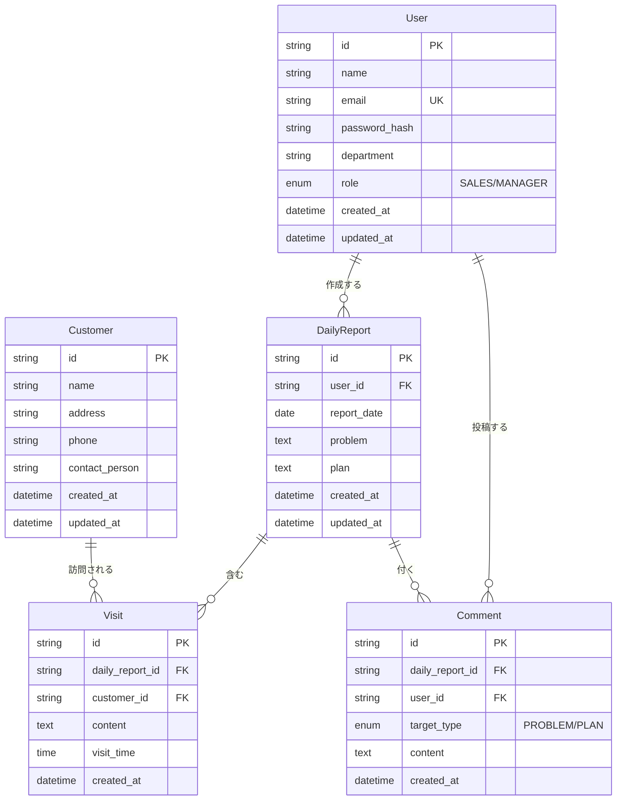
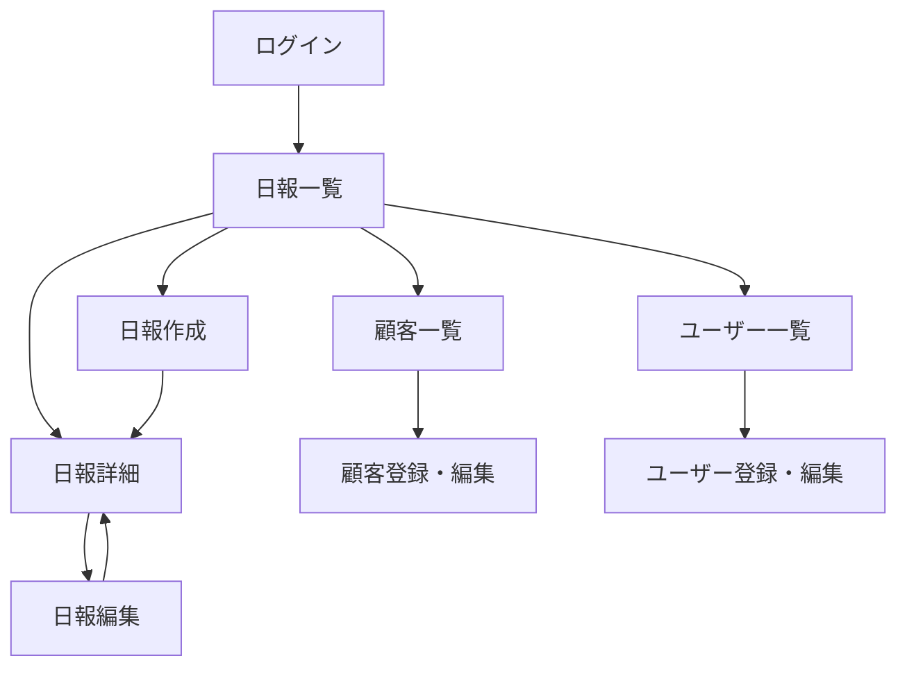

# CLAUDE.md

営業日報システム プロジェクト仕様書

## ドキュメントインポート

@docs/requirements.md
@docs/er-diagram.md
@docs/screen-definition.md
@docs/api-specification.md
@docs/test-specification.md

---

## 1. システム概要

営業担当者が日々の訪問活動を報告し、上長がフィードバックを行うためのWebシステム。

### ユーザー種別

| 種別 | 説明 |
|------|------|
| 営業担当者（SALES） | 日報を作成・編集する |
| 上長（MANAGER） | 日報を閲覧し、コメントする |

---

## 2. 技術スタック

| カテゴリ | 技術 |
|---------|------|
| 言語 | TypeScript |
| フレームワーク| Next.js 15 (App Router) |
| ORM | Prisma |
| データベース | MongoDB 
| 認証 | JWT (Bearer Token) |
| スタイリング | Tailwind CSS + shadcn/ui |
| テスト | Vitest |
| デプロイ | Vercel |

---

## 3. ディレクトリ構造

```
daily-report/
├── CLAUDE.md              # 本ファイル（仕様書）
├── docs/                   # 詳細ドキュメント
│   ├── requirements.md     # 要件定義書
│   ├── er-diagram.md       # ER図
│   ├── screen-definition.md # 画面定義書
│   ├── api-specification.md # API仕様書
│   └── test-specification.md # テスト仕様書
├── src/
│   ├── app/                # Next.js App Router
│   │   ├── layout.tsx
│   │   ├── page.tsx
│   │   ├── login/
│   │   ├── reports/
│   │   ├── customers/
│   │   ├── users/
│   │   └── api/
│   │       └── [[...route]]/
│   │           └── route.ts  # Hono APIエンドポイント
│   ├── components/
│   │   ├── ui/             # shadcn/ui
│   │   └── features/       # 機能別コンポーネント
│   ├── lib/
│   │   ├── prisma.ts
│   │   ├── auth.ts
│   │   └── validations.ts
│   └── types/
├── prisma/
│   └── schema.prisma
└── tests/
    ├── unit/
    ├── integration/
    └── e2e/
```

---

## 4. 機能要件

### 4.1 日報管理機能

- 営業担当者は1日1件の日報を作成できる
- 日報には以下の情報を含む：
  - 日付
  - 訪問記録（複数件登録可能）
  - Problem（課題・相談事項）
  - Plan（明日やること）

### 4.2 訪問記録

- 1つの日報に複数の訪問記録を追加可能
- 各訪問記録には以下を含む：
  - 訪問先顧客（顧客マスタから選択）
  - 訪問内容（テキスト）
  - 訪問時間（任意）

### 4.3 コメント機能

- 上長は日報のProblem/Planに対してコメントを追加できる
- コメントは複数件追加可能
- コメント対象を指定可能（PROBLEM or PLAN）

### 4.4 マスタ管理機能

- 顧客マスタ: 顧客情報の登録・編集・削除（上長のみ）
- ユーザー管理: 営業担当者の登録・編集・削除（上長のみ）

---

## 5. ER図



### 制約

- `User.email`: メールアドレスは一意
- `DailyReport(user_id, report_date)`: 同一ユーザーの同一日付の日報は1件のみ

---

## 6. 画面一覧

| No | 画面ID | 画面名 | URL | 権限 |
|----|--------|--------|-----|------|
| 1 | LOGIN | ログイン | /login | 全員 |
| 2 | REPORT_LIST | 日報一覧 | /reports | 全員 |
| 3 | REPORT_CREATE | 日報作成 | /reports/new | 営業 |
| 4 | REPORT_EDIT | 日報編集 | /reports/[id]/edit | 営業（本人のみ） |
| 5 | REPORT_DETAIL | 日報詳細 | /reports/[id] | 全員 |
| 6 | CUSTOMER_LIST | 顧客一覧 | /customers | 全員 |
| 7 | CUSTOMER_FORM | 顧客登録・編集 | /customers/new, /customers/[id]/edit | 上長 |
| 8 | USER_LIST | ユーザー一覧 | /users | 上長 |
| 9 | USER_FORM | ユーザー登録・編集 | /users/new, /users/[id]/edit | 上長 |

### 画面遷移図



---

## 7. API一覧

| メソッド | エンドポイント | 説明 | 権限 |
|----------|---------------|------|------|
| POST | /api/auth/login | ログイン | - |
| POST | /api/auth/logout | ログアウト | 認証必須 |
| GET | /api/auth/me | ログインユーザー取得 | 認証必須 |
| GET | /api/reports | 日報一覧 | 認証必須 |
| GET | /api/reports/:id | 日報詳細 | 認証必須 |
| POST | /api/reports | 日報作成 | 営業 |
| PUT | /api/reports/:id | 日報更新 | 営業（本人） |
| DELETE | /api/reports/:id | 日報削除 | 営業（本人） |
| POST | /api/reports/:id/comments | コメント投稿 | 上長 |
| DELETE | /api/reports/:id/comments/:cid | コメント削除 | 上長（本人） |
| GET | /api/customers | 顧客一覧 | 認証必須 |
| GET | /api/customers/:id | 顧客詳細 | 認証必須 |
| POST | /api/customers | 顧客登録 | 上長 |
| PUT | /api/customers/:id | 顧客更新 | 上長 |
| DELETE | /api/customers/:id | 顧客削除 | 上長 |
| GET | /api/users | ユーザー一覧 | 上長 |
| GET | /api/users/:id | ユーザー詳細 | 上長 |
| POST | /api/users | ユーザー登録 | 上長 |
| PUT | /api/users/:id | ユーザー更新 | 上長 |
| DELETE | /api/users/:id | ユーザー削除 | 上長 |
| PUT | /api/users/:id/password | パスワード変更 | 本人/上長 |

### API共通仕様

**リクエストヘッダー**
```
Content-Type: application/json
Authorization: Bearer <token>
```

**レスポンス形式（成功時）**
```json
{
  "success": true,
  "data": { ... }
}
```

**レスポンス形式（エラー時）**
```json
{
  "success": false,
  "error": {
    "code": "ERROR_CODE",
    "message": "エラーメッセージ"
  }
}
```

**エラーコード**

| コード | 説明 |
|--------|------|
| INVALID_REQUEST | リクエスト形式が不正 |
| UNAUTHORIZED | 認証が必要 |
| FORBIDDEN | 権限がない |
| NOT_FOUND | リソースが見つからない |
| DUPLICATE_ENTRY | 重複データ |
| VALIDATION_ERROR | バリデーションエラー |

---

## 8. 主要画面仕様

### 8.1 日報作成画面

**入力項目**

| 項目名 | 項目ID | 種別 | 必須 | バリデーション |
|--------|--------|------|------|----------------|
| 日付 | report_date | date | ○ | 未来日不可 |
| 顧客名 | customer_id | select | ○ | 顧客マスタから選択 |
| 訪問時間 | visit_time | time | - | - |
| 訪問内容 | content | textarea | ○ | 1000文字以内 |
| Problem | problem | textarea | - | 2000文字以内 |
| Plan | plan | textarea | - | 2000文字以内 |

### 8.2 日報詳細画面

- 日報内容の表示（訪問記録、Problem、Plan）
- 上長のみコメント入力欄を表示
- 本人のみ「編集」ボタンを表示

---

## 9. テスト仕様

### テスト種別

| 種別 | 説明 | ツール |
|------|------|--------|
| 単体テスト | 関数・コンポーネント単位 | Jest / Vitest |
| 結合テスト | API・DB連携 | Jest / Supertest |
| E2Eテスト | 画面操作シナリオ | Playwright |

### テストカバレッジ目標

| 種別 | 目標 |
|------|------|
| 単体テスト | 80%以上 |
| 結合テスト | 主要API 100% |
| E2Eテスト | 主要シナリオ 100% |

### テストデータ

**ユーザー**

| ID | 名前 | メール | パスワード | 役職 |
|----|------|--------|------------|------|
| user_001 | 山田太郎 | yamada@example.com | password123 | SALES |
| user_002 | 佐藤花子 | sato@example.com | password123 | SALES |
| user_003 | 鈴木部長 | suzuki@example.com | password123 | MANAGER |

**顧客**

| ID | 顧客名 |
|----|--------|
| customer_001 | ABC株式会社 |
| customer_002 | XYZ商事 |
| customer_003 | DEF工業 |

---

## 10. コマンド

```bash
# 開発サーバー起動
npm run dev

# ビルド
npm run build

# 本番起動
npm run start

# リント
npm run lint

# Prisma関連
npx prisma generate      # クライアント生成
npx prisma db push       # スキーマをDBに反映
npx prisma studio        # DB管理UI

# テスト
npm run test             # 全テスト実行
npm run test:unit        # 単体テスト
npm run test:integration # 結合テスト
npm run test:e2e         # E2Eテスト
npm run test:coverage    # カバレッジレポート
```

---

## 11. 環境変数

```env
# .env.local
DATABASE_URL=mongodb+srv://xxx        # MongoDB接続文字列
JWT_SECRET=xxx                        # JWT署名用シークレット
```

---

## 12. コーディング規約

- 関数コンポーネントを使用（クラスコンポーネント不可）
- `use client` は必要な箇所のみに限定
- Server Componentsを優先的に使用
- 型定義は明示的に記述（any禁止）

### ファイル命名規則

- コンポーネント: PascalCase (`ChatMessage.tsx`)
- ユーティリティ: camelCase (`formatMessage.ts`)
- 型定義: PascalCase (`Message.ts`)

### Git Commit

- Conventional Commits形式を使用
- 例: `feat: add chat streaming`, `fix: mobile layout issue`

---

## 13. 非機能要件

| 項目 | 要件 |
|------|------|
| 対応ブラウザ | Chrome, Safari, Edge（最新版） |
| レスポンシブ | PC・タブレット対応 |
| 認証 | JWT Bearer Token |

---

## 14. 詳細ドキュメント参照

詳細な仕様は `docs/` フォルダ内のドキュメントを参照:

- [要件定義書](docs/requirements.md)
- [ER図](docs/er-diagram.md)
- [画面定義書](docs/screen-definition.md)
- [API仕様書](docs/api-specification.md)
- [テスト仕様書](docs/test-specification.md)
