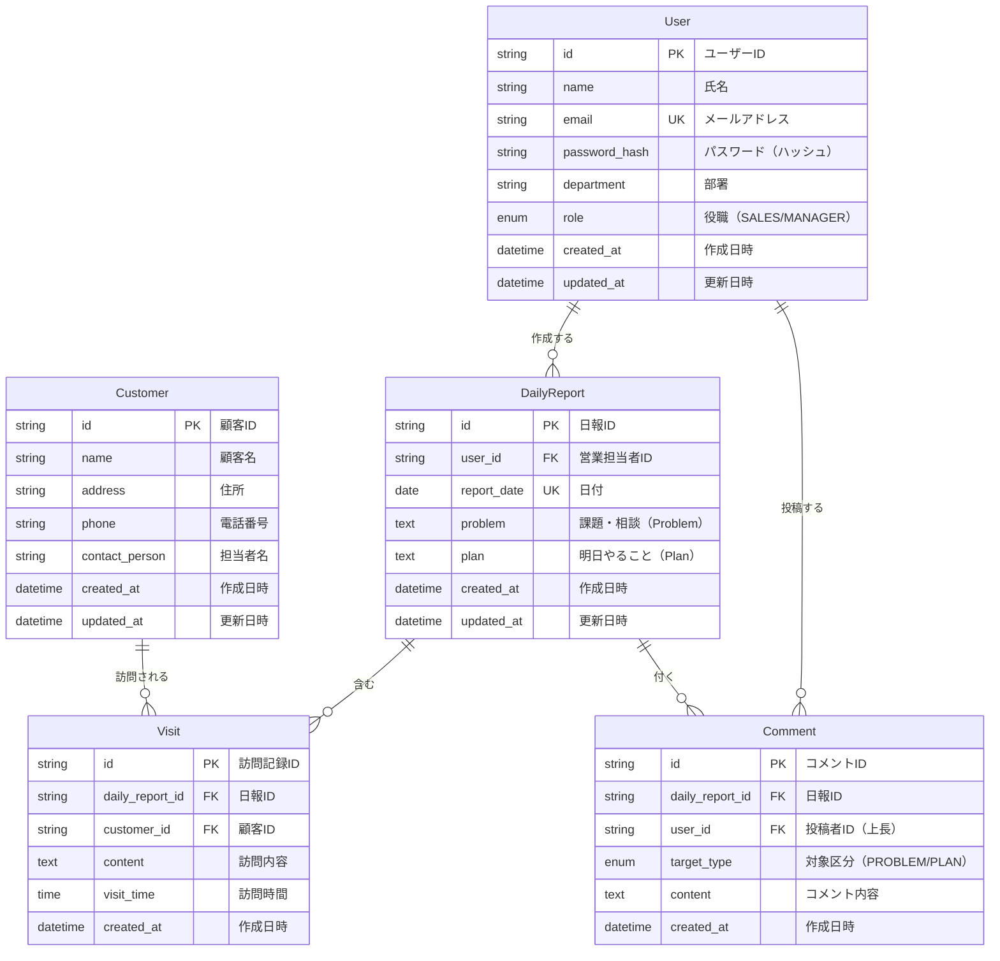
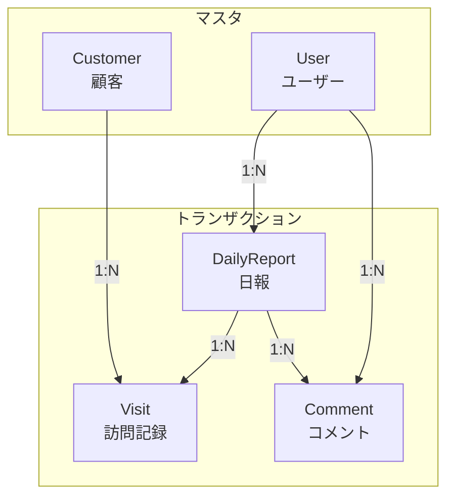

# 営業日報システム ER図

## ER図（Mermaid）

## テーブル関連図（簡易版）

## リレーション説明

| 親テーブル | 子テーブル | 関係 | 説明 |
|------------|------------|------|------|
| User | DailyReport | 1:N | 1人のユーザーが複数の日報を作成 |
| User | Comment | 1:N | 1人の上長が複数のコメントを投稿 |
| DailyReport | Visit | 1:N | 1つの日報に複数の訪問記録 |
| DailyReport | Comment | 1:N | 1つの日報に複数のコメント |
| Customer | Visit | 1:N | 1つの顧客に複数の訪問記録 |

## 制約

### ユニーク制約
- `User.email`: メールアドレスは一意
- `DailyReport(user_id, report_date)`: 同一ユーザーの同一日付の日報は1件のみ

### 外部キー制約
- `DailyReport.user_id` → `User.id`
- `Visit.daily_report_id` → `DailyReport.id`
- `Visit.customer_id` → `Customer.id`
- `Comment.daily_report_id` → `DailyReport.id`
- `Comment.user_id` → `User.id`

### Enum定義
- `User.role`: `SALES`（営業）, `MANAGER`（上長）
- `Comment.target_type`: `PROBLEM`, `PLAN`
