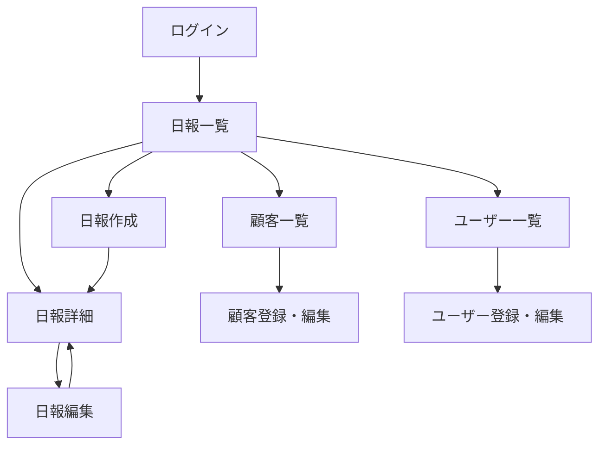

# 営業日報システム 画面定義書

## 画面一覧

| No | 画面ID | 画面名 | URL | 権限 |
|----|--------|--------|-----|------|
| 1 | LOGIN | ログイン | /login | 全員 |
| 2 | REPORT_LIST | 日報一覧 | /reports | 全員 |
| 3 | REPORT_CREATE | 日報作成 | /reports/new | 営業 |
| 4 | REPORT_EDIT | 日報編集 | /reports/[id]/edit | 営業（本人のみ） |
| 5 | REPORT_DETAIL | 日報詳細 | /reports/[id] | 全員 |
| 6 | CUSTOMER_LIST | 顧客一覧 | /customers | 全員 |
| 7 | CUSTOMER_FORM | 顧客登録・編集 | /customers/new, /customers/[id]/edit | 上長 |
| 8 | USER_LIST | ユーザー一覧 | /users | 上長 |
| 9 | USER_FORM | ユーザー登録・編集 | /users/new, /users/[id]/edit | 上長 |

---

## 1. ログイン画面（LOGIN）

### 画面イメージ

```
┌─────────────────────────────────────────────┐
│                                             │
│            営業日報システム                  │
│                                             │
│   ┌─────────────────────────────────┐       │
│   │ メールアドレス                   │       │
│   └─────────────────────────────────┘       │
│                                             │
│   ┌─────────────────────────────────┐       │
│   │ パスワード                       │       │
│   └─────────────────────────────────┘       │
│                                             │
│   ┌─────────────────────────────────┐       │
│   │         ログイン                 │       │
│   └─────────────────────────────────┘       │
│                                             │
└─────────────────────────────────────────────┘
```

### 入力項目

| No | 項目名 | 項目ID | 種別 | 必須 | バリデーション |
|----|--------|--------|------|------|----------------|
| 1 | メールアドレス | email | text | ○ | メール形式 |
| 2 | パスワード | password | password | ○ | 8文字以上 |

### ボタン

| No | ボタン名 | 動作 |
|----|----------|------|
| 1 | ログイン | 認証処理を実行、成功時は日報一覧へ遷移 |

---

## 2. 日報一覧画面（REPORT_LIST）

### 画面イメージ

```
┌─────────────────────────────────────────────────────────────────┐
│ [ロゴ] 営業日報システム              山田太郎 ▼  [ログアウト]    │
├─────────────────────────────────────────────────────────────────┤
│                                                                 │
│  日報一覧                               [+ 新規作成]            │
│                                                                 │
│  ┌─────────────┐ ┌─────────────┐ ┌─────────────┐               │
│  │ 日付        │ │ 担当者      │ │  検索       │               │
│  │ 2024/12/01 ～│ │ 全員    ▼  │ │             │               │
│  └─────────────┘ └─────────────┘ └─────────────┘               │
│                                                                 │
│  ┌───────────┬──────────┬─────────────┬─────────┬────────────┐ │
│  │ 日付      │ 担当者   │ 訪問件数    │ コメント│ 操作       │ │
│  ├───────────┼──────────┼─────────────┼─────────┼────────────┤ │
│  │ 2024/12/15│ 山田太郎 │ 3件         │ 2件     │ [詳細]     │ │
│  │ 2024/12/14│ 山田太郎 │ 2件         │ 0件     │ [詳細]     │ │
│  │ 2024/12/15│ 佐藤花子 │ 4件         │ 1件     │ [詳細]     │ │
│  └───────────┴──────────┴─────────────┴─────────┴────────────┘ │
│                                                                 │
│  ← 前へ  1 / 10  次へ →                                        │
│                                                                 │
└─────────────────────────────────────────────────────────────────┘
```

### 検索条件

| No | 項目名 | 項目ID | 種別 | 説明 |
|----|--------|--------|------|------|
| 1 | 日付（From） | date_from | date | 検索開始日 |
| 2 | 日付（To） | date_to | date | 検索終了日 |
| 3 | 担当者 | user_id | select | ユーザー一覧から選択 |

### 一覧表示項目

| No | 項目名 | 説明 |
|----|--------|------|
| 1 | 日付 | 日報の日付 |
| 2 | 担当者 | 作成者名 |
| 3 | 訪問件数 | 訪問記録の件数 |
| 4 | コメント | コメント件数 |
| 5 | 操作 | 詳細ボタン |

### ボタン

| No | ボタン名 | 動作 | 権限 |
|----|----------|------|------|
| 1 | 新規作成 | 日報作成画面へ遷移 | 営業のみ |
| 2 | 検索 | 条件で絞り込み | 全員 |
| 3 | 詳細 | 日報詳細画面へ遷移 | 全員 |

---

## 3. 日報作成画面（REPORT_CREATE）

### 画面イメージ

```
┌─────────────────────────────────────────────────────────────────┐
│ [ロゴ] 営業日報システム              山田太郎 ▼  [ログアウト]    │
├─────────────────────────────────────────────────────────────────┤
│                                                                 │
│  ← 一覧に戻る                                                   │
│                                                                 │
│  日報作成                                                       │
│                                                                 │
│  日付: ┌─────────────┐                                          │
│        │ 2024/12/15  │                                          │
│        └─────────────┘                                          │
│                                                                 │
│  ■ 訪問記録                                      [+ 追加]       │
│  ┌───────────────────────────────────────────────────────────┐ │
│  │ 顧客名    ┌──────────────────┐  時間 ┌────────┐           │ │
│  │           │ ABC株式会社   ▼  │       │ 10:00  │  [×]      │ │
│  │           └──────────────────┘       └────────┘           │ │
│  │ 訪問内容  ┌──────────────────────────────────────────────┐│ │
│  │           │ 新製品の提案。担当者の反応は良好。          ││ │
│  │           │ 来週に見積もり提出予定。                    ││ │
│  │           └──────────────────────────────────────────────┘│ │
│  └───────────────────────────────────────────────────────────┘ │
│  ┌───────────────────────────────────────────────────────────┐ │
│  │ 顧客名    ┌──────────────────┐  時間 ┌────────┐           │ │
│  │           │ XYZ商事      ▼  │       │ 14:00  │  [×]      │ │
│  │           └──────────────────┘       └────────┘           │ │
│  │ 訪問内容  ┌──────────────────────────────────────────────┐│ │
│  │           │ 定期訪問。特に問題なし。                    ││ │
│  │           └──────────────────────────────────────────────┘│ │
│  └───────────────────────────────────────────────────────────┘ │
│                                                                 │
│  ■ Problem（課題・相談）                                        │
│  ┌───────────────────────────────────────────────────────────┐ │
│  │ ABC株式会社の見積もりについて、値引き交渉があり。        │ │
│  │ 10%までの値引きは可能でしょうか？                        │ │
│  └───────────────────────────────────────────────────────────┘ │
│                                                                 │
│  ■ Plan（明日やること）                                         │
│  ┌───────────────────────────────────────────────────────────┐ │
│  │ ・ABC株式会社への見積書作成                              │ │
│  │ ・DEF工業へのアポイント電話                              │ │
│  └───────────────────────────────────────────────────────────┘ │
│                                                                 │
│           ┌─────────────┐  ┌─────────────┐                     │
│           │   保存      │  │ キャンセル  │                     │
│           └─────────────┘  └─────────────┘                     │
│                                                                 │
└─────────────────────────────────────────────────────────────────┘
```

### 入力項目

| No | 項目名 | 項目ID | 種別 | 必須 | バリデーション |
|----|--------|--------|------|------|----------------|
| 1 | 日付 | report_date | date | ○ | 未来日不可 |
| 2 | 顧客名 | customer_id | select | ○ | 顧客マスタから選択 |
| 3 | 訪問時間 | visit_time | time | - | - |
| 4 | 訪問内容 | content | textarea | ○ | 1000文字以内 |
| 5 | Problem | problem | textarea | - | 2000文字以内 |
| 6 | Plan | plan | textarea | - | 2000文字以内 |

### ボタン

| No | ボタン名 | 動作 |
|----|----------|------|
| 1 | + 追加 | 訪問記録の入力欄を追加 |
| 2 | × | 訪問記録の入力欄を削除 |
| 3 | 保存 | 日報を保存し、詳細画面へ遷移 |
| 4 | キャンセル | 一覧画面へ戻る |

---

## 4. 日報編集画面（REPORT_EDIT）

日報作成画面と同様のレイアウト。既存データが入力欄にセットされる。

### 追加制約
- 本人のみ編集可能
- 作成から48時間以内のみ編集可能（任意）

---

## 5. 日報詳細画面（REPORT_DETAIL）

### 画面イメージ

```
┌─────────────────────────────────────────────────────────────────┐
│ [ロゴ] 営業日報システム              山田太郎 ▼  [ログアウト]    │
├─────────────────────────────────────────────────────────────────┤
│                                                                 │
│  ← 一覧に戻る                                    [編集]         │
│                                                                 │
│  日報詳細                                                       │
│                                                                 │
│  日付: 2024年12月15日（日）                                     │
│  担当者: 山田太郎                                               │
│                                                                 │
│  ■ 訪問記録                                                     │
│  ┌───────────────────────────────────────────────────────────┐ │
│  │ 10:00  ABC株式会社                                        │ │
│  │ 新製品の提案。担当者の反応は良好。                        │ │
│  │ 来週に見積もり提出予定。                                  │ │
│  ├───────────────────────────────────────────────────────────┤ │
│  │ 14:00  XYZ商事                                            │ │
│  │ 定期訪問。特に問題なし。                                  │ │
│  └───────────────────────────────────────────────────────────┘ │
│                                                                 │
│  ■ Problem（課題・相談）                                        │
│  ┌───────────────────────────────────────────────────────────┐ │
│  │ ABC株式会社の見積もりについて、値引き交渉があり。        │ │
│  │ 10%までの値引きは可能でしょうか？                        │ │
│  └───────────────────────────────────────────────────────────┘ │
│    💬 コメント (1件)                                            │
│    ┌─────────────────────────────────────────────────────────┐ │
│    │ 鈴木部長  2024/12/15 18:30                              │ │
│    │ 10%までOKです。競合状況も確認してください。             │ │
│    └─────────────────────────────────────────────────────────┘ │
│    ┌─────────────────────────────────────────────────────────┐ │
│    │ コメントを入力...                           [送信]      │ │
│    └─────────────────────────────────────────────────────────┘ │
│                                                                 │
│  ■ Plan（明日やること）                                         │
│  ┌───────────────────────────────────────────────────────────┐ │
│  │ ・ABC株式会社への見積書作成                              │ │
│  │ ・DEF工業へのアポイント電話                              │ │
│  └───────────────────────────────────────────────────────────┘ │
│    💬 コメント (0件)                                            │
│    ┌─────────────────────────────────────────────────────────┐ │
│    │ コメントを入力...                           [送信]      │ │
│    └─────────────────────────────────────────────────────────┘ │
│                                                                 │
└─────────────────────────────────────────────────────────────────┘
```

### 表示項目

| No | 項目名 | 説明 |
|----|--------|------|
| 1 | 日付 | 日報の日付 |
| 2 | 担当者 | 作成者名 |
| 3 | 訪問記録 | 顧客名、時間、内容を表示 |
| 4 | Problem | 課題・相談内容 |
| 5 | Plan | 明日やること |
| 6 | コメント | Problem/Plan それぞれに対するコメント |

### コメント入力

| No | 項目名 | 項目ID | 種別 | 必須 | バリデーション |
|----|--------|--------|------|------|----------------|
| 1 | コメント | comment_content | textarea | ○ | 1000文字以内 |

### ボタン

| No | ボタン名 | 動作 | 権限 |
|----|----------|------|------|
| 1 | 編集 | 日報編集画面へ遷移 | 営業（本人のみ） |
| 2 | 送信 | コメントを投稿 | 上長のみ |

---

## 6. 顧客一覧画面（CUSTOMER_LIST）

### 画面イメージ

```
┌─────────────────────────────────────────────────────────────────┐
│ [ロゴ] 営業日報システム              山田太郎 ▼  [ログアウト]    │
├─────────────────────────────────────────────────────────────────┤
│                                                                 │
│  顧客マスタ                                     [+ 新規登録]    │
│                                                                 │
│  検索: ┌─────────────────────────┐ [検索]                       │
│        │ 顧客名で検索...         │                              │
│        └─────────────────────────┘                              │
│                                                                 │
│  ┌──────────────┬────────────────────┬────────────┬──────────┐ │
│  │ 顧客名       │ 住所               │ 電話番号   │ 操作     │ │
│  ├──────────────┼────────────────────┼────────────┼──────────┤ │
│  │ ABC株式会社  │ 東京都渋谷区...    │ 03-1234... │ [編集]   │ │
│  │ XYZ商事      │ 大阪府大阪市...    │ 06-5678... │ [編集]   │ │
│  │ DEF工業      │ 愛知県名古屋市...  │ 052-111... │ [編集]   │ │
│  └──────────────┴────────────────────┴────────────┴──────────┘ │
│                                                                 │
│  ← 前へ  1 / 5  次へ →                                         │
│                                                                 │
└─────────────────────────────────────────────────────────────────┘
```

### ボタン

| No | ボタン名 | 動作 | 権限 |
|----|----------|------|------|
| 1 | 新規登録 | 顧客登録画面へ遷移 | 上長のみ |
| 2 | 編集 | 顧客編集画面へ遷移 | 上長のみ |

---

## 7. 顧客登録・編集画面（CUSTOMER_FORM）

### 画面イメージ

```
┌─────────────────────────────────────────────────────────────────┐
│ [ロゴ] 営業日報システム              鈴木部長 ▼  [ログアウト]    │
├─────────────────────────────────────────────────────────────────┤
│                                                                 │
│  ← 一覧に戻る                                                   │
│                                                                 │
│  顧客登録                                                       │
│                                                                 │
│  顧客名 *     ┌─────────────────────────────────────┐          │
│               │                                     │          │
│               └─────────────────────────────────────┘          │
│                                                                 │
│  住所         ┌─────────────────────────────────────┐          │
│               │                                     │          │
│               └─────────────────────────────────────┘          │
│                                                                 │
│  電話番号     ┌─────────────────────────────────────┐          │
│               │                                     │          │
│               └─────────────────────────────────────┘          │
│                                                                 │
│  担当者名     ┌─────────────────────────────────────┐          │
│               │                                     │          │
│               └─────────────────────────────────────┘          │
│                                                                 │
│           ┌─────────────┐  ┌─────────────┐                     │
│           │   保存      │  │ キャンセル  │                     │
│           └─────────────┘  └─────────────┘                     │
│                                                                 │
└─────────────────────────────────────────────────────────────────┘
```

### 入力項目

| No | 項目名 | 項目ID | 種別 | 必須 | バリデーション |
|----|--------|--------|------|------|----------------|
| 1 | 顧客名 | name | text | ○ | 100文字以内 |
| 2 | 住所 | address | text | - | 200文字以内 |
| 3 | 電話番号 | phone | text | - | 電話番号形式 |
| 4 | 担当者名 | contact_person | text | - | 50文字以内 |

---

## 8. ユーザー一覧画面（USER_LIST）

### 画面イメージ

```
┌─────────────────────────────────────────────────────────────────┐
│ [ロゴ] 営業日報システム              鈴木部長 ▼  [ログアウト]    │
├─────────────────────────────────────────────────────────────────┤
│                                                                 │
│  ユーザー管理                                   [+ 新規登録]    │
│                                                                 │
│  ┌────────────┬─────────────────────┬────────┬────────┬──────┐ │
│  │ 氏名       │ メールアドレス      │ 部署   │ 役職   │ 操作 │ │
│  ├────────────┼─────────────────────┼────────┼────────┼──────┤ │
│  │ 山田太郎   │ yamada@example.com  │ 営業1課│ 営業   │[編集]│ │
│  │ 佐藤花子   │ sato@example.com    │ 営業1課│ 営業   │[編集]│ │
│  │ 鈴木部長   │ suzuki@example.com  │ 営業部 │ 上長   │[編集]│ │
│  └────────────┴─────────────────────┴────────┴────────┴──────┘ │
│                                                                 │
└─────────────────────────────────────────────────────────────────┘
```

---

## 9. ユーザー登録・編集画面（USER_FORM）

### 入力項目

| No | 項目名 | 項目ID | 種別 | 必須 | バリデーション |
|----|--------|--------|------|------|----------------|
| 1 | 氏名 | name | text | ○ | 50文字以内 |
| 2 | メールアドレス | email | email | ○ | メール形式、重複不可 |
| 3 | パスワード | password | password | ○（新規時） | 8文字以上 |
| 4 | 部署 | department | text | - | 50文字以内 |
| 5 | 役職 | role | select | ○ | SALES / MANAGER |

---

## 画面遷移図



---

## 共通ヘッダー

全画面に以下のヘッダーを表示:

- ロゴ・システム名
- ナビゲーションメニュー（日報一覧 / 顧客マスタ / ユーザー管理※上長のみ）
- ログインユーザー名
- ログアウトボタン
